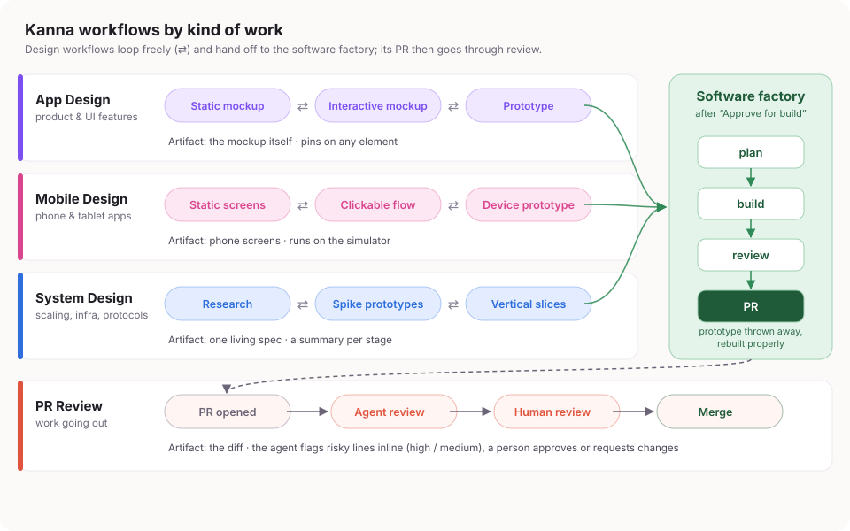

# App Design: design-first workflows

Status: owner-directed design, approved for build 2026-09-26, from task `2d6b4196`. The design was
worked out by building it: a mockup, an interactive mockup, then a working
prototype that the owner used and marked up. This spec records what the
prototype proved, the decisions the owner made along the way, and what remains
open. It describes what Kanna should do, not how to build it; the planning stage
decides that. Statements marked **Owner** were decided by the owner and are not
open. **Prototype** marks behaviour that was built and used in the prototype.
**Proposed** and **Open** are not decisions.

It builds on the structured-workflows work
([`tasks-sessions-structured-workflows.md`](tasks-sessions-structured-workflows.md),
merged in #1641 on 2026-09-26): its `designed` workflow, `mockup` agent, artifact
store, named exits and gate stages. Where the two differ, this spec says so.

## 1. Why

Written design specs are slow to read, easy to misread, and let the owner and
agents drift into different ideas of the same thing. **Owner:** for new or large
work, especially work with a UI, the shared understanding should come from
something you can see and use, built with an agent, not from a document. The
accepted result is handed to the existing software factory to be built properly.

## 2. Design workflows by kind of work

**Owner:** a task follows a workflow that fits its kind of work. Two design
templates, each ending in a hand-off to the software factory:

| Workflow | For | Stages | Artifact |
|---|---|---|---|
| **App Design** | Features with a UI | Static mockup ⇄ Interactive mockup ⇄ Prototype | The mockup or app itself, marked up in place |
| **System Design** | Scaling, infrastructure, protocols | Research ⇄ Spike prototypes ⇄ Vertical slices | One living spec document, with a summary of each stage's work |

- **Owner:** within a design workflow you move freely between stages, back and
  forth (⇄); there is no "shared doc" stage.
- **Owner:** PR review is a different kind of work with its own workflow
  (`pr-review`). A PR Review template with a diff pane where the agent flags
  risky lines inline is a good idea for later, outside this spec's scope.
- **Open:** whether mobile apps get their own **Mobile Design** template
  (static screens ⇄ clickable flow ⇄ device prototype) or stay on App Design.
  The prototype showed a mobile task on App Design with a device preview.

After "Approve for build" (§6) the task continues through the software factory
(plan → build → review → PR), and its PR goes through PR review as usual.

## 3. One live session

**Owner:** design is a live loop between a person and one agent in one session:
you react, the agent revises, repeat. There is no reviewer agent and no
send-back loop, because iterating with a person is not an agent review.

- **Owner:** iterations are inherently serial, so nothing is gained by parallel
  sessions or by starting a new session. A design task keeps **one live session
  and one workspace** from its first stage to the hand-off; moving between
  design stages never starts a new session. How the engine does that (one
  engine stage with the design stages as positions inside it, or a transition
  that keeps the session the way the structured-workflows commit step instructs
  the live session in place) is a planning decision.
- Only committed work crosses the hand-off to the software factory (§6).

## 4. The design surface

**Prototype**, refined by the owner's markup. The desktop task view for a design
task:

- **Sidebar:** tasks, each with a badge for its kind of work.
- **Header:** the task title and its stage chain, labelled with the workflow's
  name. Design stages are clickable (⇄); other workflows move forward only (→).
  **Owner:** no Doc/Mockup/Prototype tabs, because you are in one stage at a
  time. The main area shows **the current stage's artifact**.
- **Agent terminal (left):** the real agent session, in its TUI, per Kanna's
  first principle that the agent's terminal is the main interaction. Delivered
  feedback (§8) appears there as input. (The prototype showed a mock panel of
  what reached the session, with an input line; the real product uses the
  terminal itself, not an imitation of it.)
- **Artifact (centre):** the stage's artifact (§5), with the hand-off bar below:
  "Approve for build →" on design tasks, "Request changes / Approve PR" on PR
  review.
- **Feedback → agent (right):** comment threads, oldest to newest, scrolled to
  the newest. **Owner:** threads are ordered and numbered by when they were
  created, not by their latest reply; resolved threads are hidden behind a
  toggle at the top; each thread can be resolved and reopened.
- **Owner:** one comment panel at a time. When the artifact is a mockup with its
  own pin comments, the feed makes way for them.
- **Owner:** one consistent light/dark palette for the whole app, following the
  system setting, with a toggle.

### Doc editing and comments

**Prototype** on BlockNote (a block editor on Yjs sync):

- The doc is live and shared: the person's edits and the agent's merge as they
  type. The agent edits blocks by id; it never rewrites the whole doc.
- **Owner:** comments are hard to miss: commented text is tinted and underlined,
  not just highlighted.
- **Owner:** one toolbar. Selecting text shows the formatting toolbar with a
  "💬 Comment ⌘↵" button first; ⌘↵ also starts a comment.
- **Owner:** `/agent` messages the agent from anywhere in the doc. It
  autocompletes in place (Tab or Enter picks it from the / menu, focus stays in
  the line), and the next Enter sends. Tab picks any highlighted / menu item.
  A message is a thread with no anchor, answered in the same thread.

## 5. Artifacts per stage

- **Static and interactive mockups** are HTML (**Owner**, from the structured
  spec: text lives in HTML, never in a PNG). They render sandboxed, and the
  person pins comments on any element; a pin names the element (tag, id,
  classes, container), its visible text and an HTML excerpt. **Owner**
  (2026-09-27): ⌘-click (Ctrl-click off macOS) pins; a plain click uses the
  mockup, so an interactive mockup stays clickable. There is still no mode to
  switch into; the outline shows while ⌘ is held.
- **Prototypes** are real, throwaway code (§7) in a disposable repository.
- **System Design** keeps one living spec document, grown stage by stage, with a
  per-stage summary.
- **Mobile** (**Prototype**, **Owner**-directed):
  - **Default: the app's HTML, live.** The app page renders at phone size
    (iPhone 16, 393 × 852), reloads on save, and a click pins the element under
    it (⌥-click uses the app).
  - **Toggle: the real iOS Simulator.** A live view of a booted simulator, where
    a click pins a spot on the screen; the agent receives the spot as zoom and
    context crops with a ring on it. "Open in Simulator" opens the same device in
    Xcode's simulator app for native input.
  - **Owner:** marking up is always on; you don't switch into a mode.

## 6. Hand-off: Approve for build

**Prototype.** "Approve for build" (with a confirmation that says what happens):

1. commits the disposable prototype repository; that commit is what was approved;
2. publishes a snapshot (the built prototype, its committed source and an
   approval note) to Kanna's artifact store;
3. records the decision "approved for build" on that exact artifact id; and
4. tells the task's live session what was approved.

The artifact store is used when the Kanna build has it; either way the approval
is the prototype commit plus its snapshot, and what is kept afterwards follows
the project's policy (§7a).

**Owner:** the UI shows no version number; the approval still records the exact
commit behind the scenes. Approval is the person's action, never an agent's.
After approval the stage chain shows the hand-off to the software factory, and
"Reopen design" returns to the design stages.

## 7. Prototypes are disposable

**Owner:** prototype code is thrown away. It is the basis and the idea for the
real build, not production code. It lives in a disposable git repository that is
passed around; its last commit is what gets signed off. The software factory
rebuilds it properly.

- **Owner:** sharing a disposable repository across machines should use
  **Radicle**. **Open:** a Radicle identity needs the owner's passphrase
  (`rad auth`); private repositories on the LAN connect directly, and across the
  internet need a direct connection or a seed node the owner runs.

## 7a. What is kept at the hand-off

**Owner:** what happens to the live docs, threads and artifacts after the
hand-off is decided by **project policy**. For Kanna itself: don't keep every
version; keep **the results and a summary**, committed into the monorepo. That
commit is **a step of the workflow** at the hand-off, not a manual chore. For
this design it is the spec plus the final artifacts in
[`app-design/`](app-design/) (§12).

## 8. Feedback reaches the agent's live session

**Prototype.** Every kind of feedback is delivered into the task's live agent
session as recorded operator input (`kanna-cli task send-input --source
operator`), with enough context for the agent to act without asking:

| Feedback | Arrives with |
|---|---|
| Doc comment | the text it is anchored to |
| `/agent` message or session-panel input | the message |
| Mockup pin | the element's label, container, visible text and HTML excerpt |
| App (HTML) pin | the same, plus the selector |
| Simulator pin | the spot as a percentage, and zoom and context crops with a ring on it |

- **Owner:** feedback is **queued** and fed to the agent as it becomes free, not
  typed into the session mid-turn. (The prototype delivered immediately, and
  comments landed in the middle of the agent's work.)
- Each message carries the thread id and how to answer in place; the agent
  replies in the thread, resolves it, or edits the artifact.
- The surface shows each comment's delivery status ("delivered to session ✓",
  "agent replied", "not delivered").
- Delivery must survive restarts: records of what was delivered live with the
  artifact, so a restart delivers only what is new and nothing is lost.

## 9. What the prototype taught

Recorded so the real build does not repeat them:

1. **A mismatched editor schema destroys content.** When an agent client reads a
   Yjs doc with a narrower schema than the browser's (it lacked the comment
   mark), y-prosemirror deleted the text it could not convert, and the deletion
   synced to the person. Any client that joins a doc must use the same schema,
   and agent-side reads should work on a copy.
2. **A watcher that expires loses feedback.** Polling watchers stopped silently;
   the real path is delivery by the server, with catch-up on reconnect.
3. **Anchors sync after threads.** A comment's thread can arrive a moment before
   its text anchor; delivery should wait briefly for the anchor.
4. **Sandboxed frames have origin `null`.** An embedded dev server must allow it
   (CORS) or its scripts never load.
5. **Xcode 27 moved the Simulator.** Simulators open in `DeviceHub.app`
   (`com.apple.dt.Devices`), not `Simulator.app`; open it by bundle id. A
   machine may point `DEVELOPER_DIR` at the Command Line Tools, so simulator
   tooling should use Xcode's path explicitly.
6. **Screenshots make the Simulator flash.** Capture only while a preview is
   watched.

## 10. Building it

**Owner:** vertical slices are vertical: each slice captures **all layers** as
the work moves through it (UI, server, agent tools, delivery), not one layer at
a time. The software factory builds this spec that way.

**Proposed** slice order, each one end to end:

1. **App Design core:** a design task in one live session; the live doc with
   comments and `/agent`; feedback queued to the agent's terminal; the agent's
   tools to edit, reply and resolve (§10a); Approve for build with the results
   committed per policy.
2. **Mockups:** static and interactive mockup stages with element pins.
3. **System Design:** the living spec document with per-stage summaries.
4. **Mobile:** the live HTML device view with element pins; the simulator view.

Later, outside the first slices: the long-term simulator approach, Radicle
sharing, one comment model.

### 10a. Agent tools

**Proposed:** the prototype's agent used scripts to read and edit the live doc,
reply to and resolve threads, publish mockups and answer pins. In the product
these become Kanna tools (MCP and `kanna-cli`) with a stable contract, and the
`mockup` agent definition uses them.

## 11. Not in scope, and open questions

- **Simulator long term (Open).** Users run Kanna, they don't build it, so
  nothing from Kanna's own toolchain can be assumed. Options:
  - *Stream a view* (what the prototype does: `simctl` screenshots, about 2 fps,
    view only). Also works for the mobile companion through the relay.
  - *Inject input* with WebDriverAgent (BSD, Apple's public XCTest APIs; built
    into the simulator on first run) or idb (MIT, but relies on private Apple
    frameworks that break with Xcode releases).
  - *Dock the real window:* place the simulator's own window over an area of
    Kanna's UI. The launch position needs no permission (the simulator app
    stores a per-device window centre and scale); keeping it aligned as Kanna
    moves needs a one-time Accessibility permission. Full native input and frame
    rate, nothing extra shipped.
  - Apple's terms: the Simulator ships with Xcode and cannot be redistributed;
    users need Xcode on a Mac.
- **One comment model (Proposed).** The prototype stitched BlockNote threads and
  mockup pins together through the bridge. The real build should have one Kanna
  comment model across docs, mockups, app pins and messages.
- **Where live docs are served (Open).** The prototype ran its own Yjs sync
  server. Recommended: inside `kanna-server`, which already owns durable task
  state and the API, reaches the phone through the relay, and can queue
  delivery itself; the alternative is a separate sync process.
- **What the phone gets (Open).** Kanna treats mobile as a first-class
  companion. Recommended minimum: view the current stage's artifact and
  comment or pin from the phone; otherwise V1 is explicitly desktop only.
- **Element identity on the simulator (Open).** A simulator pin knows *where*
  but not *what*; a native app would need the accessibility tree (XCTest).
- Multi-user editing beyond one person and one agent, and cross-account sharing
  of live docs, are not in scope.

## 12. The final artifacts

The last revision of each design artifact is kept next to this spec, as text
(HTML and SVG). Open them in a browser; they need nothing else.

| File | What it is |
|---|---|
| [`workflows.svg`](app-design/workflows.svg) | The workflow map (§2) |
| [`static-mockup.html`](app-design/static-mockup.html) | The first static mockup of the design surface |
| [`interactive-mockup.html`](app-design/interactive-mockup.html) | The final interactive mockup: four tasks on their own workflows, stage artifacts, slash menu, comments, approval. Its Prototype stage embeds the live prototype, so that view is empty unless the prototype is running |
| [`mobile-static.html`](app-design/mobile-static.html), [`mobile-interactive.html`](app-design/mobile-interactive.html) | The mobile task's static and interactive mockups |
| [`mobile-app.html`](app-design/mobile-app.html) | The mobile prototype's app page, as shown live and on the simulator |
| [`merge-diff.html`](app-design/merge-diff.html) | The PR review diff with the agent's risk flags |

The working prototype itself is throwaway code and is not kept in the
repository (§7, §7a).

**Approved for build** by the owner on 2026-09-26 (given in the design
session): prototype commit `5b93047b10a2890351c239262d1c1bd74f37215c`. The
approval note is [`app-design/APPROVAL.md`](app-design/APPROVAL.md). The
approved snapshot (the built prototype, its source at that commit and the note)
is artifact `01e43bb75d4df7aaa46c2bc0860ee4e0c88881b6` in repository
`repo-18d823663f668988`'s artifact store, with the decision "approved for build"
recorded on it. Under Kanna's policy (§7a) the committed results in this folder
remain the record kept in the repository.

Evidence: the prototype's disposable repository (`.tmp/prototype` in task
`2d6b4196`'s worktree, 2026-09-25), the 18 pins on the interactive mockup, and
the owner's comments and `/agent` messages in the prototype's docs.
